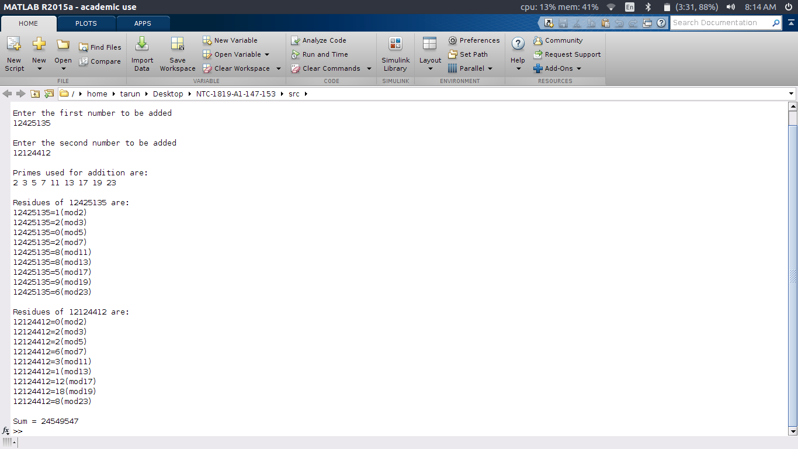
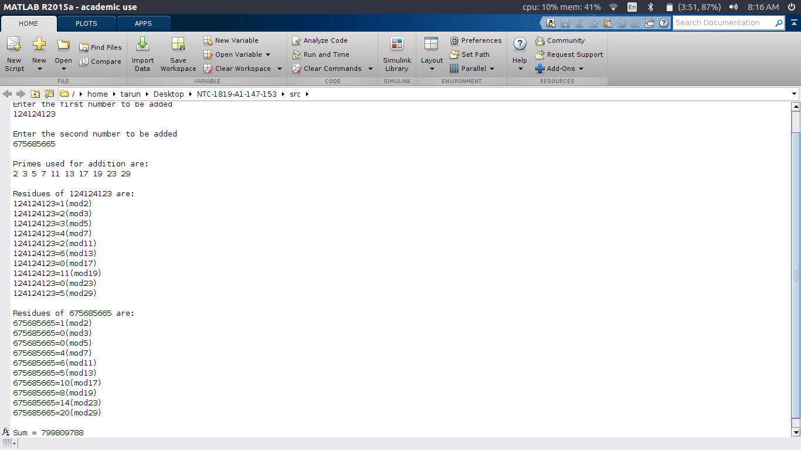
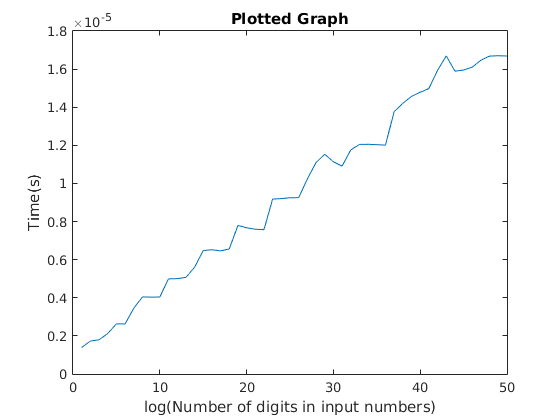

## Adding Two Large Numbers using Chinese Remainder Theorem

### Problem Statement
Problem Number 27 - Write a MATLAB code to add large integers exceeding the word size of the computer using the Chinese remainder theorem.

### Team Members
Tarun Anand - 16CO147

Archit Pandey - 16CO153

### Tools used
1. Matlab
2. Octave

### The Chinese Remainder Theorem
[Reference](https://crypto.stanford.edu/pbc/notes/numbertheory/crt.html)

Suppose we wish to solve the equations:  
```math
	x=a(modp) ... (i)
	x=b(modq) ... (ii)
```
where p and q are co-prime.
The Chinese Remainder Theorem states that there exists a unique solution for x (mod pq).

Let p<sub>1</sub>=p<sup>-1</sup>(modq) and q<sub>1</sub>=q<sup>-1</sup>(modp). These must exist since *p*,*q* are coprime. Then if *y* is an integer such that y=aqq<sub>1</sub>+bpp<sub>1</sub> (modpq) then *y* satisfies both equations (i) and (ii).

To find y, using Euclid's Extended Algorithm:
1. Find m and n such that $`pm+qn=1`$.
2. y is given by $`y=pmb+qna`$

### Euclid's Extended Algorithm
[Reference](https://crypto.stanford.edu/pbc/notes/numbertheory/euclid.html)

For any 2 integers *a* and *b* Euclid's Extended Algorithm helps us find 2 integers *x* and *y* such that  
```math
	ax + by = gcd(a,b)
```
The following steps help us determine *x* and *y*  
```math
	if b = 0
		then the gcd(a,b) = a and x=1,y=0
	else
		r = a mod b
		Recursively use the algorithm to obtain x' and y' where bx' + ry' = gcd(b,r)
		x = y'
		y = x' - floor(a,b)*y'
		gcd(a,b) = gcd(b,r)

```
The calculated values *x* and *y* are utilized in the Chinese Remainder Theorem.

### Directory Structure
1. src/main.m - main function
2. src/crt.m - module containing code for Chinese Remainder Theorem
3. src/euclid.m - module containing code for Extended Euclid's Algorithm
4. src/genPrimes.m - module containing code that generates primes to be utilized for Chinese Remainder Theorem
5. src/addusingCRT.m - module containing code that adds two numbers using Chinese Remainder Theorem
6. src/plotter.m - module containing code for benchmarking addUsingCRT code
7. src/printArrayWithMessage.m - module containing code for formatted printing of an array
8. src/unused/ - folder that contains various modules which were written but not utilized in final code
9. img/ - folder that containing screenshots and graphs plotted

### Screenshots
Screenshot showing main code being run for input 12425135 and 12124412.


Screenshot showing main code being run for input 124124123 and 675685665.


### Graph
To benchmark our code we ran a simulation to add two random numbers of increasing size upto 2<sup>50</sup>. We plotted a graph of time taken vs log(number), which came out to be linear. From this we could conclude that our algorithm takes *exponential* time.


### Further work
Our work on addition using Chinese Remainder Theorem can be extended to:
* Parallel Computation: addition of residues can be distributed to multiple processors for parallel addition.